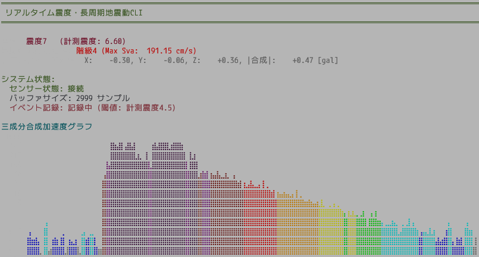

# kyoshin-sensor-tui

本プロジェクトは、STMicroelectronics ISM330DHCX 加速度センサーを用いてリアルタイムに地震動を観測し、以下の指標を計算・表示・記録するツールです。

- 震度（気象庁震度階級相当）のリアルタイム算出
- 長周期地震動階級（LPGM）のリアルタイム算出と Sva(30s) 最大値の追跡
- 端末画面へのリアルタイム表示（加速度・震度・長周期地震動・接続状態）
- 閾値超過イベントの自動記録（CSV への出力、観測点メタ情報を付与）
- センサー自動キャリブレーションおよび接続状態監視
- サンプル CSV からのバッチ検証（テスト）

## 主要機能

- センサー取得
  - I2C 経由で ISM330DHCX から 3軸加速度を取得
  - サンプリングレートの自動取得と欠損耐性のあるループ設計
  - 自動キャリブレーション、接続監視、失敗回数の可視化

- 震度計算（SindoCalculator）
  - サンプリングレート・バッファ長を指定可能
  - g/gal の取り扱いに対応（センサー入力は g 単位）
  - 適切なフィルタリングを用いたリアルタイム震度推定
  - 最大震度の継続評価

- 長周期地震動計算（LpgmCalculator）
  - LPGM 階級のリアルタイム算出
  - Sva(30s) の最大値を継続追跡

- 表示（RealTimeDisplay）
  - 震度・加速度・LPGM・バッファサイズ・接続状態を TUI でリアルタイム表示
  - 表示更新間隔の最適化（描画負荷の低減）

- イベント記録（EventRecorder）
  - 震度が設定閾値を超過した区間をイベントとして自動抽出
  - 観測点コード・名称・緯度経度・サンプリングレートを付加して CSV 出力
  - 出力ディレクトリ管理

- データ入出力
  - Shift_JIS エンコードの CSV 読み込みに対応（サンプル検証用）
  - 実測データの書き出し（イベント CSV）

- 検証とサンプル
  - `samples/` に実データ例を同梱
  - 震度および長周期地震動階級の期待値に対する自動テストを実装

## ディレクトリ構成（抜粋）

- `src/` コア実装
  - `sensor.rs` センサー管理
  - `sindo_calculator.rs` 震度計算
  - `lpgm_calculator.rs` 長周期地震動計算
  - `display.rs` リアルタイム表示
  - `event_recorder.rs` イベント記録
  - `braille_graph.rs` 端末描画補助
  - `util.rs` 共通型・ユーティリティ
  - `lib.rs` CSV 読み込みとテスト補助
- `samples/` サンプル CSV と README
- `exports/` イベント出力先（実行時に生成）

## その他

- センサー性能の都合上、震度2以下まではノイズに埋もれて計測ができません。

## サンプル

